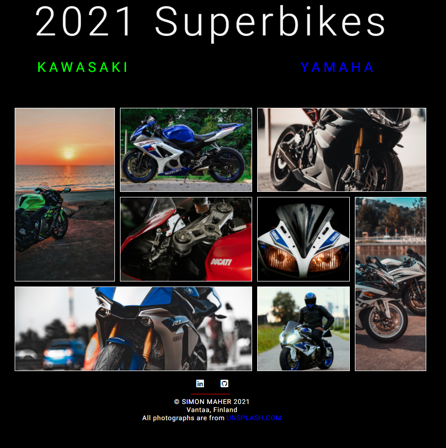

# 2021 Superbikes

This small project is part of my CSS portfolio which is designed to help me learn and explore the potential of CSS. The page was built using HTML and CSS GRID with the aim of building a mini Superbike gallery. On hover, the user can click and expand the image to view full size.

# Aim

CSS GRID is a fantastic tool that enables is to create two-dimensional grid-based layouts which adapts efficiently to the users screen size. As a Web Developer it is important that I can use and understand its potential, and so this Superbike gallery helped me to implement some previous GRID lessons. 

# Problems

I used GRID AREAS for the first time and duplicated the individual images to expand across columns and rows. I'm not sure if this was the most efficient, but it seemed to work ok on this project.

# Tech stack

* HTML
* CSS GRID

# Preview

# [Demo]()

# Author

Simon Maher